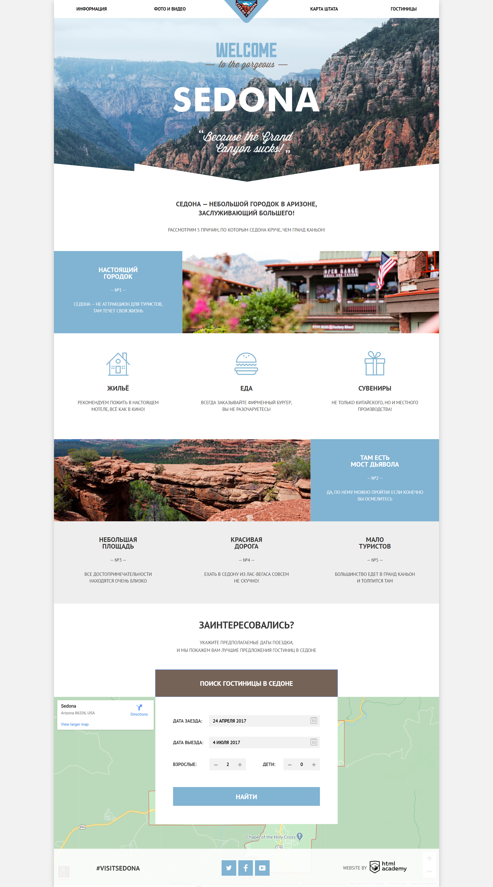
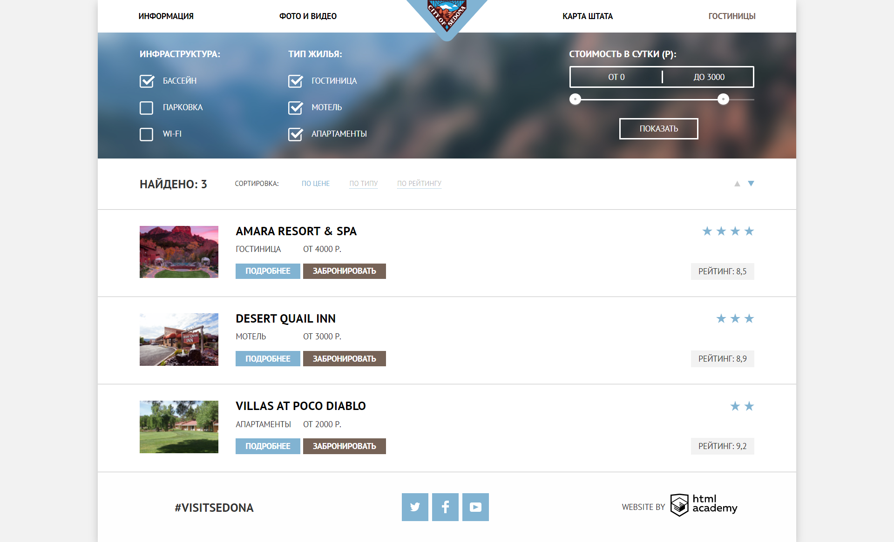

# Project «Sedona»
---
### [Demo](https://vannyle.github.io/sedona/)
---
* Student: [Vanny Le](https://up.htmlacademy.ru/htmlcss/26/user/1163991).
* Mentor: `Victoria Kovalenko`.
---

Created while attending course «[HTML и CSS, уровень 1](https://htmlacademy.ru/intensive/htmlcss)» от [HTML Academy](https://htmlacademy.ru).

### Main page

### Inner page

